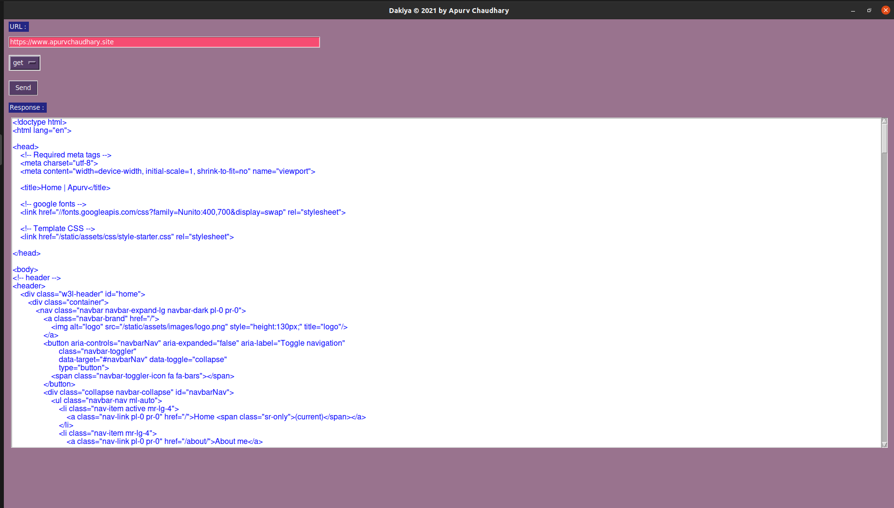

<h1 style="color:orange"> Dakiya </h1>

<h2 style="color:orange"> GUI for API development like postman </h2>

<h3 style="color:green"> Steps to install & run </h3>
<h4> Step 1 :  clone repo https as its public </h4>
<h4> Step 2 :  create python3 virtual environment ~python3 -m venv env_name OR by pyenv </h4>
<h4> Step 3 :  install all dependencies ~pip install -r requirements.txt </h4>
<h4> Step 4 :  run main.py </h4>